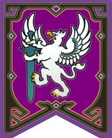
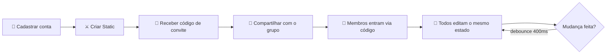
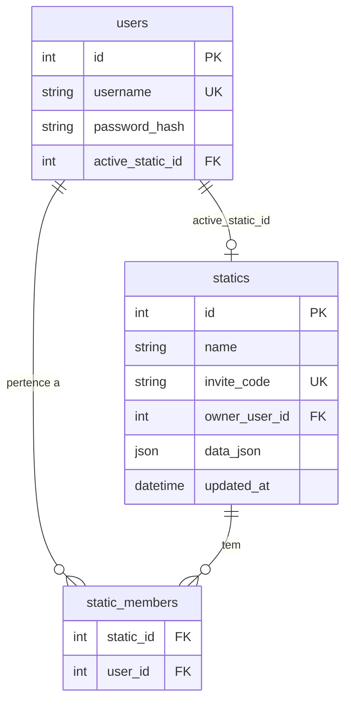

<div align="center">


# FFXIV Raid Planner

### ⚔️ Little Ala Mhigos ⚔️

**Planejador premium de Static para Final Fantasy XIV.**
Gerencie roster, agenda, equipamentos, prioridade de loot e estratégias do seu grupo de raid — tudo em um só lugar, com a estética do jogo.

<br />

[](https://www.python.org/)
[](https://flask.palletsprojects.com/)
[](https://www.sqlite.org/)
[](#-disclaimer)
[](#-deploy)

<br />



</div>

---

##  Sumário

- [✨ Features](#-features)
- [🚀 Quick Start](#-quick-start)
- [📦 Instalação Detalhada](#-instalação-detalhada)
- [🎮 Fluxo de Uso](#-fluxo-de-uso)
- [🛠️ Configuração](#️-configuração)
- [🌐 Deploy](#-deploy)
- [📡 API Reference](#-api-reference)
- [🏗️ Arquitetura](#️-arquitetura)
- [💎 Créditos](#-créditos)
- [⚖️ Disclaimer](#️-disclaimer)

---

##  Features

<table>
<tr>
<td width="50%" valign="top">

###  Visão Geral
Dashboard com progs ativos, próximos eventos e status do grupo num único painel — pega o feel das interfaces do jogo.

</td>
<td width="50%" valign="top">

###  Roster
Cadastre membros com job principal, jobs secundários, fuso horário e disponibilidade. Atribuição automática por role (Tank / Healer / DPS).

</td>
</tr>
<tr>
<td width="50%" valign="top">

###  Equipamentos & Loot
Tracking de BiS, prioridade de loot por slot, histórico de drops e contagem de Tomestones por membro.

</td>
<td width="50%" valign="top">

###  Agenda Semanal
Cronograma de raids com reset weekly automático, RSVP por membro e indicador visual de quórum (8/8).

</td>
</tr>
<tr>
<td width="50%" valign="top">

###  Estratégias & Macros
Editor de macros com syntax highlight FFXIV (`/p`, `/mk`, `<wait.X>`), notas de fase e timeline de mecânicas.

</td>
<td width="50%" valign="top">

###  Sync em Tempo Real
Autosave com debounce de 400ms — todo mundo da static vê as mudanças assim que salvam. Sem conflitos, sem refresh.

</td>
</tr>
</table>

**Bônus de polimento:**
- 🎨 Tema dual (Dark Souls / Classic Blue UI) com persistência local
- 🔊 SFX autênticos do FFXIV em cada interação
- 💾 Export/Import JSON para backup ou compartilhamento
- 🔐 Auth por sessão com PBKDF2 (sem senha em texto plano, sem JWT)
- 📱 Responsivo (mobile, tablet, ultrawide)

---

##  Quick Start

> Setup completo em **menos de 60 segundos**. Tudo que você precisa é Python 3.11+.

```bash
# 1. Clone
git clone https://github.com/oscarothon/ffxiv-raid-planner.git
cd ffxiv-raid-planner

# 2. Setup do ambiente
python -m venv .venv
source .venv/bin/activate          # Linux/Mac
# .venv\Scripts\activate            # Windows PowerShell

# 3. Dependências + run
pip install -r requirements.txt
python -m server.app
```

🌐 Abra **`http://127.0.0.1:5000`** no navegador. O `data.db` é criado automaticamente na primeira execução.

> ⚠️ **Não use `file://`** — o backend Flask precisa estar rodando para servir o estado da static.

---

##  Instalação Detalhada

<details>
<summary><strong>🐧 Linux / 🍎 macOS</strong></summary>

```bash
git clone https://github.com/oscarothon/ffxiv-raid-planner.git
cd ffxiv-raid-planner

python3 -m venv .venv
source .venv/bin/activate

pip install --upgrade pip
pip install -r requirements.txt

python -m server.app
```

</details>

<details>
<summary><strong>🪟 Windows PowerShell</strong></summary>

```powershell
git clone https://github.com/oscarothon/ffxiv-raid-planner.git
cd ffxiv-raid-planner

python -m venv .venv
.venv\Scripts\activate

pip install --upgrade pip
pip install -r requirements.txt

python -m server.app
```

Se o PowerShell bloquear o `Activate.ps1`:

```powershell
Set-ExecutionPolicy -Scope CurrentUser -ExecutionPolicy RemoteSigned
```

</details>

<details>
<summary><strong>🐳 Docker (opcional)</strong></summary>

```bash
# Build
docker build -t ffxiv-raid-planner .

# Run com volume persistente
docker run -p 5000:5000 \
  -v $(pwd)/data:/var/data \
  -e DATABASE_PATH=/var/data/data.db \
  -e SECRET_KEY=$(openssl rand -hex 32) \
  ffxiv-raid-planner
```

</details>

---

##  Fluxo de Uso



### Passo a passo

1. **Cadastrar conta** — usuário (3–32 chars) + senha (≥ 6 chars). Hash com PBKDF2.
2. **Criar Static** — gera um código de convite único (ex: `aBc12xYz`).
3. **Compartilhar código** — qualquer um com o código entra na static e vê os mesmos dados.
4. **Editar livremente** — mudanças salvam automaticamente (debounce 400ms). Sem botão "Salvar".
5. **Trocar de static** — um usuário pode pertencer a múltiplas statics e alternar a ativa.

> 💡 **Dica**: Use o botão **💾 Compartilhar / Dados** no header para exportar todo o estado como JSON. Útil para backups antes de mexer em algo crítico.

---

##  Configuração

### Variáveis de ambiente

| Variável         | Padrão                  | Descrição                                                    |
|------------------|-------------------------|--------------------------------------------------------------|
| `SECRET_KEY`     | `dev-only-key-...`      | Chave para assinar cookies de sessão. **Troque em produção.** |
| `DATABASE_PATH`  | `./data.db`             | Caminho do arquivo SQLite                                    |
| `FLASK_ENV`      | —                       | `production` ativa cookies `Secure` (HTTPS only)             |
| `PORT`           | `5000`                  | Porta do servidor                                            |

### Exemplo `.env`

```bash
SECRET_KEY=$(python -c "import secrets; print(secrets.token_hex(32))")
DATABASE_PATH=/var/data/data.db
FLASK_ENV=production
PORT=8080
```

---

##  Deploy

### Render (recomendado)

1. Push do repositório para o GitHub
2. Em [render.com](https://render.com) → **New Web Service** → conecte o repo
3. O `render.yaml` é detectado automaticamente:
   - Provisiona disco persistente de **1 GB** para o SQLite
   - Gera `SECRET_KEY` único
   - Faz deploy via gunicorn

🌐 URL final: `https://ffxiv-raid-planner.onrender.com`

> ⚠️ **Free tier hiberna após 15 min sem tráfego** — primeira request demora ~30s. Configure [UptimeRobot](https://uptimerobot.com) pingando a URL a cada 5 min para evitar.

### Railway

```bash
railway init
railway volume add /var/data
railway variables set SECRET_KEY=$(openssl rand -hex 32)
railway variables set DATABASE_PATH=/var/data/data.db
railway up
```

### Fly.io

```bash
fly launch                              # detecta Python, gera fly.toml
fly volumes create sqlite_data --size 1
# editar fly.toml para mount /var/data e env DATABASE_PATH
fly deploy
```

### Self-host (VPS / homelab)

```bash
# systemd unit
sudo tee /etc/systemd/system/ffxiv-planner.service <<EOF
[Unit]
Description=FFXIV Raid Planner
After=network.target

[Service]
WorkingDirectory=/opt/ffxiv-raid-planner
ExecStart=/opt/ffxiv-raid-planner/.venv/bin/gunicorn server.app:app -b 0.0.0.0:5000
Environment=SECRET_KEY=...
Environment=DATABASE_PATH=/var/lib/ffxiv-planner/data.db
Restart=always

[Install]
WantedBy=multi-user.target
EOF

sudo systemctl enable --now ffxiv-planner
```

---

##  API Reference

Todos os endpoints retornam JSON. Auth é por cookie de sessão HTTP-only (`Set-Cookie` após login).

### Auth

| Método | Rota                       | Auth | Body                              | Resposta                          |
|--------|----------------------------|------|-----------------------------------|-----------------------------------|
| POST   | `/api/register`            | —    | `{ username, password }`          | `{ id, username, active_static_id }` |
| POST   | `/api/login`               | —    | `{ username, password }`          | `{ id, username, active_static_id }` |
| POST   | `/api/logout`              | —    | —                                 | `{ ok: true }`                    |
| GET    | `/api/me`                  | ✓    | —                                 | `{ id, username, active_static_id }` |

### Statics (grupos)

| Método | Rota                       | Auth | Body                              | Resposta                          |
|--------|----------------------------|------|-----------------------------------|-----------------------------------|
| POST   | `/api/statics`             | ✓    | `{ name }`                        | `{ id, name, invite_code }`       |
| POST   | `/api/statics/join`        | ✓    | `{ invite_code }`                 | `{ id, name }`                    |
| GET    | `/api/statics/mine`        | ✓    | —                                 | `[{ id, name, invite_code }]`     |
| POST   | `/api/statics/switch`      | ✓    | `{ static_id }`                   | `{ ok, active_static_id }`        |

### Estado (blob compartilhado)

| Método | Rota                       | Auth | Body                              | Resposta                          |
|--------|----------------------------|------|-----------------------------------|-----------------------------------|
| GET    | `/api/state`               | ✓    | —                                 | `{ static_id, static_name, data, updated_at }` |
| PUT    | `/api/state`               | ✓    | `{ ...estado_completo }`          | `{ ok: true }`                    |

### Exemplo (curl)

```bash
# Login
curl -c cookies.txt -X POST http://localhost:5000/api/login \
  -H "Content-Type: application/json" \
  -d '{"username":"warrior_of_light","password":"hydaelyn123"}'

# Buscar estado
curl -b cookies.txt http://localhost:5000/api/state | jq

# Atualizar estado
curl -b cookies.txt -X PUT http://localhost:5000/api/state \
  -H "Content-Type: application/json" \
  -d @meu-estado.json
```

---

##  Arquitetura

### Stack

| Camada     | Tecnologia                                        |
|------------|---------------------------------------------------|
| Frontend   | HTML5 + CSS3 + Vanilla JS (zero frameworks)       |
| Backend    | Flask 3 + Werkzeug                                |
| DB         | SQLite 3 (single-file, ACID)                      |
| Auth       | Session cookies HTTP-only + PBKDF2 password hash  |
| Tipografia | [Cinzel](https://fonts.google.com/specimen/Cinzel) (SIL OFL) |

### Estrutura

```
.
├── index.html                ← Entry point (servido pelo Flask)
├── css/
│   └── styles.css            ← 52 KB de pura UI FFXIV
├── js/
│   ├── api.js                ← Cliente HTTP (fetch wrapper)
│   ├── data.js               ← Estado local + persistência
│   └── app.js                ← Controllers das abas + DOM
├── server/
│   ├── app.py                ← Flask app + endpoints REST
│   ├── auth.py               ← @login_required + current_user
│   └── db.py                 ← Schema SQLite + helpers
├── assets/
│   ├── logo/fc-banner.webp   ← Logo da Free Company
│   └── icons/dictionary/     ← 900+ ícones do Dictionary of Icons
├── requirements.txt          ← flask, gunicorn, werkzeug
├── render.yaml               ← Config de deploy do Render
└── Procfile                  ← gunicorn server.app:app
```

### Modelo de dados



O **`data_json`** da tabela `statics` guarda **todo o estado da static** (roster, equipamentos, agenda, estratégias) como um único blob JSON. Tradeoff consciente: simplicidade de schema vs. queries SQL ricas — para 8 jogadores e ~50 KB de estado, ganhamos a simplicidade.

---

##  Roadmap

- [x] Autenticação multi-usuário com sessões
- [x] Static compartilhada com código de convite
- [x] Editor de macros com syntax highlight
- [x] Sistema de prioridade de loot
- [x] Reset weekly automático
- [ ] Histórico de mudanças (audit log)
- [ ] Integração com Lodestone API (verificação de char)
- [ ] Notificações Discord webhook
- [ ] Modo "Ultimate" com timeline de fases

---

##  Contribuindo

PRs são bem-vindos. Fluxo recomendado:

1. Fork e clone
2. `git checkout -b feat/minha-feature`
3. Code + commit (siga o estilo do repo)
4. Push + abra PR descrevendo o **porquê**, não só o **o quê**
5. Aguarde review do `@oscarothon`

> 💬 Dúvidas, ideias ou bug reports? Abra uma [issue](https://github.com/oscarothon/ffxiv-raid-planner/issues).

---

##  Créditos

- **Tipografia** — [Cinzel](https://fonts.google.com/specimen/Cinzel) por Natanael Gama (SIL OFL). Roman caps decorativa que captura a estética FFXIV.
- **Ícones** — [Dictionary of Icons](https://ffxiv.gamerescape.com/wiki/Dictionary_of_Icons) (FFXIV Gamer Escape Wiki). 900+ ícones extraídos do client e disponibilizados pela comunidade.
- **Free Company** — Little Ala Mhigos (Behemoth, Primal DC)
- **Construído por** — Oscar Othon ([@oscarothon](https://github.com/oscarothon)) e Renato Lousan ([@renatolousan](https://github.com/renatolousan))

---

##  Disclaimer

Projeto **fan-made** sem afiliação oficial. **FINAL FANTASY XIV** é propriedade intelectual da **Square Enix Co., Ltd.** Todos os direitos da marca, logo, jobs, classes, bosses e arte do jogo pertencem aos respectivos detentores. Este projeto não distribui nenhum asset proprietário de Square Enix — os ícones são fornecidos pela comunidade da wiki Gamer Escape sob seus próprios termos.

---

<div align="center">


**Made with ⚔️ by the warriors of Little Ala Mhigos**

*"The light shall lead you on..."*

</div>
