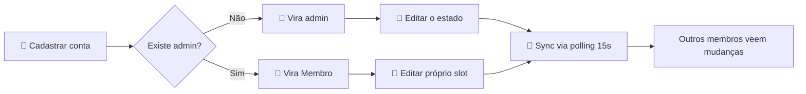
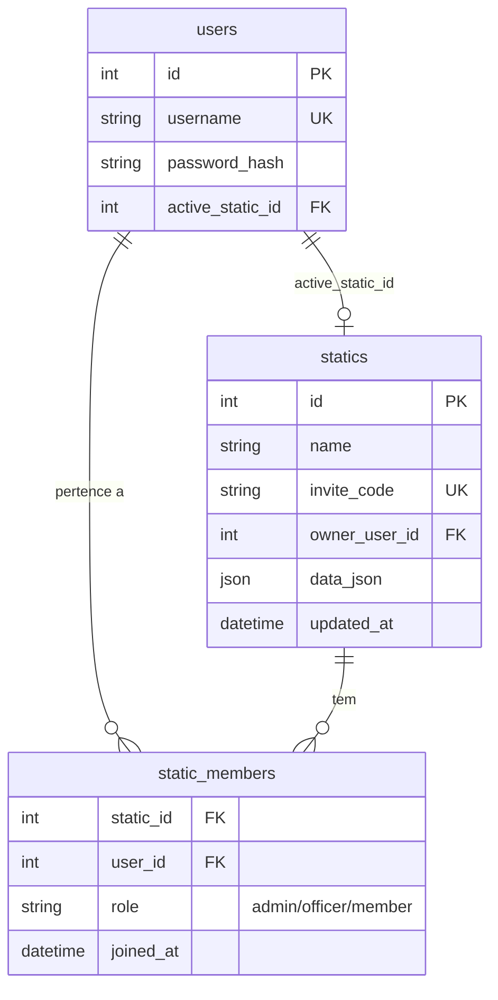

<div align="center">


# FFXIV Raid Planner

### ⚔️ Little Ala Mhigos ⚔️

**Planejador premium de Static para Final Fantasy XIV.**
Gerencie roster, agenda, equipamentos e prioridade de loot do seu grupo de raid — tudo em um só lugar, com a estética do jogo.

<br />

[](https://www.python.org/)
[](https://flask.palletsprojects.com/)
[](https://www.sqlite.org/)
[](https://railway.com/)
[](https://mhigos-raid-planner.up.railway.app)

<br />

🌐 **Produção:** [mhigos-raid-planner.up.railway.app](https://mhigos-raid-planner.up.railway.app)

<br />


</div>

---

##  Sumário

- [✨ Features](#-features)
- [🚀 Quick Start](#-quick-start)
- [📦 Instalação Detalhada](#-instalação-detalhada)
- [🎮 Fluxo de Uso](#-fluxo-de-uso)
- [🛡️ Sistema de Cargos](#-sistema-de-cargos)
- [🛠️ Configuração](#-configuração)
- [🌐 Deploy](#-deploy)
- [📡 API Reference](#-api-reference)
- [🏗️ Arquitetura](#-arquitetura)
- [📈 Roadmap](#-roadmap)
- [💎 Créditos](#-créditos)
- [⚖️ Disclaimer](#-disclaimer)

---

##  Features

<table>
<tr>
<td width="50%" valign="top">

###  Visão Geral
Dashboard com progs ativos, próximos eventos e status do grupo num único painel — pega o feel das interfaces do jogo.

</td>
<td width="50%" valign="top">

###  Roster com Cargos
Sistema de **Admin / Officer / Membro**. Cada cargo tem permissões específicas — admin gerencia contas, officers controlam conteúdo e agenda, members editam o próprio slot.

</td>
</tr>
<tr>
<td width="50%" valign="top">

###  Equipamentos & Loot
Need / Greed / Pass por slot e jogador, em cada conteúdo separadamente. Fila de prioridade de loot para resolver conflitos.

</td>
<td width="50%" valign="top">

###  Agenda Mensal
Calendário com disponibilidade de cada jogador, agendamento de raid por dia, e predição de quórum (8/8) com escalação automática de reservas.

</td>
</tr>
<tr>
<td width="50%" valign="top">

###  Sync em Tempo Real
Mudanças de outros membros chegam automaticamente via polling com ETag (304 Not Modified). UI preserva foco, scroll e aba ativa — sem refresh manual.

</td>
<td width="50%" valign="top">

###  Gerenciamento por Admin
Admins removem contas (com modal de confirmação tematizado), atribuem cargos, e protegem o estado contra mudanças não autorizadas via validação por diff no backend.

</td>
</tr>
</table>

**Bônus de polimento:**
- 🎨 Tema dual (Dark / Classic Blue) — mais um tema "Warrior of Darkness" em breve
- 🔊 SFX autênticos do FFXIV em cada interação (Web Audio API, sem assets externos)
- 🔐 Auth por sessão com PBKDF2 (sem JWT, sem senha em texto plano)
- 🍞 Toasts tematizados em vez de `alert()` do browser
- 🪙 Ícones nativos do jogo (`log_out.png`, `system_configuration.png`, etc.) substituem emojis em botões de ação
- ↩️ Tecla Enter no login/registro dispara o botão correspondente

---

##  Quick Start

> Setup completo em **menos de 60 segundos**. Tudo que você precisa é Python 3.12.

```bash
# 1. Clone
git clone https://github.com/oscarothon/ffxiv-raid-planner.git
cd ffxiv-raid-planner

# 2. Setup do ambiente
python -m venv .venv
source .venv/bin/activate          # Linux/Mac
# .venv\Scripts\activate            # Windows PowerShell

# 3. Dependências + run
pip install -r requirements.txt
python -m server.app
```

🌐 Abra **`http://127.0.0.1:5000`** no navegador. O `data.db` é criado automaticamente na primeira execução.

> ⚠️ **Não use `file://`** — o backend Flask precisa estar rodando para servir o estado da static.

> 🛡️ **O primeiro usuário a se cadastrar vira admin automaticamente** (bootstrap). Demais usuários entram como Membros e podem ser promovidos pelo admin.

---

##  Instalação Detalhada

<details>
<summary><strong>🐧 Linux / 🍎 macOS</strong></summary>

```bash
git clone https://github.com/oscarothon/ffxiv-raid-planner.git
cd ffxiv-raid-planner

python3 -m venv .venv
source .venv/bin/activate

pip install --upgrade pip
pip install -r requirements.txt

python -m server.app
```

</details>

<details>
<summary><strong>🪟 Windows PowerShell</strong></summary>

```powershell
git clone https://github.com/oscarothon/ffxiv-raid-planner.git
cd ffxiv-raid-planner

python -m venv .venv
.venv\Scripts\activate

pip install --upgrade pip
pip install -r requirements.txt

python -m server.app
```

Se o PowerShell bloquear o `Activate.ps1`:

```powershell
Set-ExecutionPolicy -Scope CurrentUser -ExecutionPolicy RemoteSigned
```

</details>

---

##  Fluxo de Uso



### Passo a passo

1. **Cadastrar conta** — usuário (3–32 chars) + senha (≥ 6 chars). Hash com PBKDF2.
2. **Primeiro user vira admin** automaticamente da static global.
3. **Promover/rebaixar** outros usuários pelo modal "Membros" no header (apenas admin).
4. **Editar livremente** dentro das suas permissões — mudanças salvam automaticamente (debounce 400ms).
5. **Sync automático** — a cada 15 segundos o frontend pergunta ao backend se algo mudou; se sim, atualiza preservando foco/scroll. Toast notifica.

---

##  Sistema de Cargos

| Ação | Admin | Officer | Membro |
|------|:-----:|:-------:|:------:|
| Gerenciar cargos | ✅ | — | — |
| Excluir contas | ✅ | — | — |
| Criar/excluir conteúdos da static | ✅ | ✅ | — |
| Agendar datas no calendário | ✅ | ✅ | — |
| Reordenar prioridade de loot | ✅ | ✅ | — |
| Editar slots de outros players | ✅ | ✅ | — |
| Editar **próprio** slot | ✅ | ✅ | ✅ |
| Marcar **própria** disponibilidade | ✅ | ✅ | ✅ |
| Need/Greed/Pass nos **próprios** equipamentos | ✅ | ✅ | ✅ |

**Bootstrap:** o primeiro membro de cada static é automaticamente promovido a admin. Isso vale para a static global e para statics criadas via invite code.

**Backend protege contra burla:** mesmo se um member tentar modificar dados via DevTools, o backend valida o diff entre o estado novo e o antigo, rejeitando alterações fora do escopo do cargo (HTTP 403 `forbidden_changes` com reversão automática da UI).

---

##  Configuração

### Variáveis de ambiente

| Variável         | Padrão                  | Descrição                                                    |
|------------------|-------------------------|--------------------------------------------------------------|
| `SECRET_KEY`     | `dev-only-key-...`      | Chave para assinar cookies de sessão. **Troque em produção.** |
| `DATABASE_PATH`  | `./data.db`             | Caminho do arquivo SQLite (use `/data/data.db` em volume)    |
| `FLASK_ENV`      | —                       | `production` ativa cookies `Secure` (HTTPS only)             |
| `PORT`           | `5000`                  | Porta do servidor                                            |

### Exemplo `.env`

```bash
SECRET_KEY=$(python -c "import secrets; print(secrets.token_urlsafe(48))")
DATABASE_PATH=/data/data.db
FLASK_ENV=production
PORT=8080
```

---

##  Deploy

### Railway (em uso na produção)

Guia completo passo a passo em **[DEPLOY-RAILWAY.md](DEPLOY-RAILWAY.md)**.

Resumo:
1. Criar projeto em [railway.com](https://railway.com) apontando para o repo do GitHub
2. Adicionar **Volume** montado em `/data`
3. Setar variáveis: `SECRET_KEY`, `DATABASE_PATH=/data/data.db`, `FLASK_ENV=production`
4. Gerar **domínio público** em Networking
5. Pronto — primeiro user cadastrado vira admin

O `railway.json` na raiz configura builder NIXPACKS e o startCommand do gunicorn.

### Self-host (VPS / homelab)

```bash
# systemd unit
sudo tee /etc/systemd/system/ffxiv-planner.service <<EOF
[Unit]
Description=FFXIV Raid Planner
After=network.target

[Service]
WorkingDirectory=/opt/ffxiv-raid-planner
ExecStart=/opt/ffxiv-raid-planner/.venv/bin/gunicorn server.app:app -b 0.0.0.0:5000
Environment=SECRET_KEY=...
Environment=DATABASE_PATH=/var/lib/ffxiv-planner/data.db
Restart=always

[Install]
WantedBy=multi-user.target
EOF

sudo systemctl enable --now ffxiv-planner
```

---

##  API Reference

Todos os endpoints retornam JSON. Auth é por cookie de sessão HTTP-only (`Set-Cookie` após login).

### Auth

| Método | Rota                       | Auth  | Body                              | Resposta                              |
|--------|----------------------------|-------|-----------------------------------|---------------------------------------|
| POST   | `/api/register`            | —     | `{ username, password }`          | `{ id, username, active_static_id }`  |
| POST   | `/api/login`               | —     | `{ username, password }`          | `{ id, username, active_static_id }`  |
| POST   | `/api/logout`              | —     | —                                 | `{ ok: true }`                        |
| GET    | `/api/me`                  | ✓     | —                                 | `{ id, username, active_static_id, role }` |

### Statics

| Método | Rota                       | Auth  | Body                              | Resposta                          |
|--------|----------------------------|-------|-----------------------------------|-----------------------------------|
| POST   | `/api/statics`             | ✓     | `{ name }`                        | `{ id, name, invite_code }`       |
| POST   | `/api/statics/join`        | ✓     | `{ invite_code }`                 | `{ id, name }`                    |
| GET    | `/api/statics/mine`        | ✓     | —                                 | `[{ id, name, invite_code }]`     |
| POST   | `/api/statics/switch`      | ✓     | `{ static_id }`                   | `{ ok, active_static_id }`        |

### Membros e Cargos

| Método | Rota                                              | Auth  | Body              | Notas                                  |
|--------|---------------------------------------------------|-------|-------------------|----------------------------------------|
| GET    | `/api/statics/<id>/members`                       | ✓     | —                 | Lista membros com cargos               |
| PUT    | `/api/statics/<id>/members/<uid>/role`            | admin | `{ role }`        | `admin / officer / member`. Bloqueia rebaixar último admin |
| DELETE | `/api/statics/<id>/members/<uid>`                 | admin | —                 | Deleta a **conta inteira**. Bloqueia auto-delete e último admin |

### Estado da Static

| Método | Rota          | Auth | Headers          | Body                | Resposta                                                                 |
|--------|---------------|------|------------------|---------------------|--------------------------------------------------------------------------|
| GET    | `/api/state`  | ✓    | `If-None-Match`  | —                   | `{ static_id, static_name, data, etag, user_id, user_role }` ou `304`    |
| PUT    | `/api/state`  | ✓    | —                | `{ ...estado }`     | `{ ok, etag, updated_at }` ou `403 forbidden_changes` com lista de violações |

### Exemplo (curl)

```bash
# Login
curl -c cookies.txt -X POST http://localhost:5000/api/login \
  -H "Content-Type: application/json" \
  -d '{"username":"warrior_of_light","password":"hydaelyn123"}'

# Buscar estado
curl -b cookies.txt http://localhost:5000/api/state -o state.json

# Salvar com If-None-Match (recebe 304 se nada mudou)
curl -b cookies.txt http://localhost:5000/api/state \
  -H 'If-None-Match: "abc123..."'

# Promover user a officer (precisa ser admin)
curl -b cookies.txt -X PUT http://localhost:5000/api/statics/1/members/42/role \
  -H "Content-Type: application/json" \
  -d '{"role":"officer"}'
```

---

##  Arquitetura

### Stack

| Camada     | Tecnologia                                        |
|------------|---------------------------------------------------|
| Frontend   | HTML5 + CSS3 + Vanilla JS (zero frameworks)       |
| Backend    | Flask 3 + Werkzeug                                |
| DB         | SQLite 3 (single-file, ACID, com volume montado)  |
| Auth       | Session cookies HTTP-only + PBKDF2 password hash  |
| Sync       | Polling 15s com ETag + If-None-Match (304)        |
| Tipografia | [Cinzel](https://fonts.google.com/specimen/Cinzel) (SIL OFL) |

### Estrutura

```
.
├── index.html                ← Entry point (servido pelo Flask)
├── PLANNING.md               ← Roadmap detalhado das fases
├── DEPLOY-RAILWAY.md         ← Guia de deploy passo a passo
├── css/
│   └── styles.css            ← Pura UI FFXIV, temas, toasts, modais
├── js/
│   ├── api.js                ← Cliente HTTP (fetch wrapper) + getStateConditional
│   ├── data.js               ← Catálogo de jobs, raids, ultimates, gear slots
│   └── app.js                ← Controllers + render + polling + showConfirm + showToast
├── server/
│   ├── app.py                ← Flask app + endpoints REST + validação por diff
│   ├── auth.py               ← @login_required + get_user_role + require_role
│   └── db.py                 ← Schema SQLite + migração idempotente
├── assets/
│   ├── logo/fc-banner.webp   ← Logo da Free Company
│   └── icons/dictionary/     ← 900+ ícones do Dictionary of Icons
├── requirements.txt          ← flask, gunicorn, werkzeug
├── railway.json              ← Config de deploy do Railway
└── Procfile                  ← gunicorn server.app:app
```

### Modelo de dados



O **`data_json`** da tabela `statics` guarda **todo o estado da static** (roster, equipamentos, agenda, prioridade de loot) como um único blob JSON. Tradeoff consciente: simplicidade de schema vs. queries SQL ricas — para 8 jogadores e ~50 KB de estado, ganhamos a simplicidade.

O backend **valida cada PUT por diff**: compara o estado antigo com o novo e rejeita mudanças fora do escopo do cargo do usuário, retornando `403 forbidden_changes` com lista das violações.

---

##  Roadmap

### Concluído

- [x] Autenticação multi-usuário com sessões PBKDF2
- [x] Static compartilhada com código de convite
- [x] Sistema de cargos (Admin / Officer / Membro) com validação por diff
- [x] Modal admin para gerenciar membros (promover/rebaixar/excluir contas)
- [x] Sincronização entre contas via polling com ETag (15s)
- [x] Toasts tematizados substituindo `alert()` do browser
- [x] Modal de confirmação tematizado substituindo `confirm()` do browser
- [x] Deploy em produção no Railway com volume persistente
- [x] Ícones nativos do jogo nos botões do header e ações do roster

### Próximas (ver `PLANNING.md` para detalhes)

- [ ] Bugfixes: tooltip dos slots, label do bracelete, atualização silenciosa de slots/datas
- [ ] Remover botão "Compartilhar / Dados" (sync já cobre o caso)
- [ ] Calendário: clicar na data abre modal de agendamento + notificação no dashboard
- [ ] Drag & drop na prioridade de loot
- [ ] Tema "Warrior of Darkness" (roxo escuro) + consertar o botão Tema
- [ ] Tipos de conteúdo customizáveis (Full Party 8 / Light Party 4 / Dinâmico 1–8)
- [ ] Cadastro com aprovação por officer/admin (timeout de 24h)
- [ ] Redesign visual da lista de conteúdos (cards animados)
- [ ] Responsividade completa (mobile, tablet, ultrawide)

---

##  Contribuindo

PRs são bem-vindos. Fluxo recomendado:

1. Fork e clone
2. `git checkout -b feat/minha-feature`
3. Code + commit (siga o estilo do repo)
4. Push + abra PR descrevendo o **porquê**, não só o **o quê**
5. Aguarde review do `@oscarothon`

> 💬 Dúvidas, ideias ou bug reports? Abra uma [issue](https://github.com/oscarothon/ffxiv-raid-planner/issues).

---

##  Créditos

- **Tipografia** — [Cinzel](https://fonts.google.com/specimen/Cinzel) por Natanael Gama (SIL OFL). Roman caps decorativa que captura a estética FFXIV.
- **Ícones** — [Dictionary of Icons](https://ffxiv.gamerescape.com/wiki/Dictionary_of_Icons) (FFXIV Gamer Escape Wiki). 900+ ícones extraídos do client e disponibilizados pela comunidade.
- **Free Company** — Little Ala Mhigos (Behemoth, Primal DC)
- **Construído por** — Oscar Othon ([@oscarothon](https://github.com/oscarothon)) e Renato Lousan ([@renatolousan](https://github.com/renatolousan))

---

##  Disclaimer

Projeto **fan-made** sem afiliação oficial. **FINAL FANTASY XIV** é propriedade intelectual da **Square Enix Co., Ltd.** Todos os direitos da marca, logo, jobs, classes, bosses e arte do jogo pertencem aos respectivos detentores. Este projeto não distribui nenhum asset proprietário de Square Enix — os ícones são fornecidos pela comunidade da wiki Gamer Escape sob seus próprios termos.

---

<div align="center">


**Made with ⚔️ by the warriors of Little Ala Mhigos**

*"The light shall lead you on..."*

</div>
